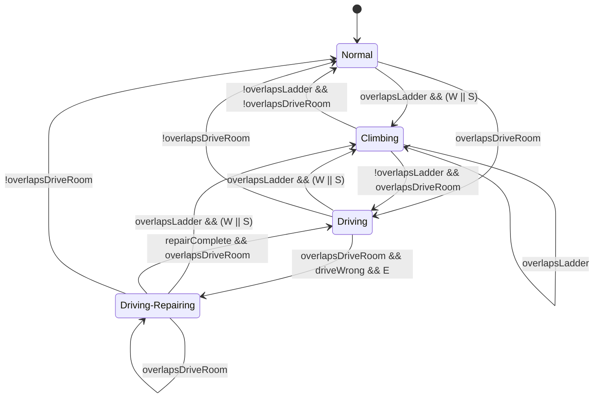

# GameJam Phaser

一个基于 Phaser、TypeScript 和 Vite 的游戏项目。

## 项目说明

当前项目使用 Phaser 创建游戏场景，通过 Vite 提供开发服务器和生产构建。游戏入口位于 `src/main.ts`，页面入口位于 `index.html`。

当前场景会加载 `assets/scene/space.png` 作为底层背景，`assets/scene/spaceShip.png` 作为飞船场景，并根据画布尺寸自适应缩放。玩家逻辑仍使用一个隐藏的胶囊形 `Graphics` 对象作为移动和碰撞锚点，实际显示层使用 Unity `Player.prefab` 复刻出的分层 2D 角色。

## 技术栈

- Phaser 4
- TypeScript
- Vite

## 目录结构

```text
.
├── assets/          # 游戏资源
│   ├── scene/       # 场景图、覆盖层和物理标记图
│   ├── player-prefab/ # 从 Unity prefab 复制出的玩家分层贴图
│   └── Sound/       # 音频资源
├── src/
│   ├── main.ts      # 游戏入口和主场景
│   ├── style.css    # 全局样式
│   └── vite-env.d.ts
├── index.html       # 页面入口
├── package.json     # 项目脚本和依赖
└── vite.config.ts   # Vite 配置
```

## 安装依赖

```bash
npm install
```

## 本地开发

```bash
npm run dev
```

开发服务器默认会监听 `0.0.0.0`，方便在局域网设备中访问。

## 构建项目

```bash
npm run build
```

该命令会先运行 TypeScript 类型检查，然后使用 Vite 生成生产构建文件。

## 预览构建结果

```bash
npm run preview
```

## 资源路径

游戏资源放在 `assets/` 目录中，可以在 Phaser 中通过绝对路径加载，例如：

```ts
this.load.image('background', '/assets/scene/spaceShip.png');
```

## 物理系统

项目当前使用 `assets/scene/physic.png` 作为像素级物理标记图。该图片不会直接显示在游戏场景中，而是在运行时通过 Canvas 读取像素数据，并转换成用于碰撞和状态检测的数据层。

`physic.png` 的尺寸应与主场景图一致，目前为 `1672x941`。由于它与 `space.png`、`spaceShip.png`、`drive.png` 等场景图尺寸一致，可以直接使用场景坐标进行像素采样，不需要额外坐标换算。

### 颜色语义

- `#FFFFFF`：实体碰撞层。玩家在启用白色碰撞检测时不能穿过该区域。
- `#FF0000`：梯子触发层。该区域本身不阻挡玩家移动，用于检测玩家是否进入爬梯状态。
- 房间自身贴图 alpha mask：用于房间区域状态检测，例如 `drive.png` 的非透明像素用于检测玩家是否进入 `Driving` 状态；该 mask 不阻挡玩家移动。
- 透明像素或其他颜色：无物理语义，默认忽略。

读取像素时会忽略 alpha 过低的像素，当前阈值为：

```ts
const COLLISION_ALPHA_THRESHOLD = 16;
```

### 数据生成

运行时会把 `physic.png` 拆成两个 `Uint8Array` 数据层：

- `collisionData`：由 `#FFFFFF` 像素生成，用于实体阻挡。
- `ladderData`：由 `#FF0000` 像素生成，用于梯子区域检测。

核心语义等价于：

```ts
collisionData[index] = r === 255 && g === 255 && b === 255 ? 1 : 0;
ladderData[index] = r === 255 && g === 0 && b === 0 ? 1 : 0;
```

### 碰撞检测

玩家当前是一个胶囊形显示对象，但物理检测使用玩家包围盒进行采样。检测时会在玩家包围盒内部和边缘按固定步长采样像素，目前采样步长为 `4` 像素。

移动时采用 X/Y 分轴处理：

- 先尝试 X 轴移动，如果目标位置碰撞则取消 X 轴位移。
- 再尝试 Y 轴移动，如果目标位置碰撞则取消 Y 轴位移。
- 这种方式允许玩家沿墙滑动，行为类似常见角色控制器。

场景边界外默认视为不可通行。

### 玩家状态机

当前玩家状态有四个：

- `Normal`
- `Climbing`
- `Driving`
- `Driving-Repairing`

当前 `updatePlayerState()` 的状态转换：



`Normal` 状态规则：

- 重力开启。
- 白色 `#FFFFFF` 碰撞检测开启。
- 红色 `#FF0000` 区域不阻挡玩家移动。
- 玩家接触红色区域并按下 `W` 或 `S` 时，切换到 `Climbing`。

`Climbing` 状态规则：

- 重力关闭。
- 白色 `#FFFFFF` 碰撞检测关闭。
- `A` / `D` 仍然响应，允许左右移动。
- 已处于 `Climbing` 时，只要下一帧仍接触红色 `#FF0000` 区域，就保持 `Climbing`，不再要求持续按 `W` 或 `S`。
- 玩家离开红色 `#FF0000` 区域时，切回 `Normal`。

`Driving` 状态规则：

- 玩家进入 Drive 房间 alpha mask 区域时切换到该状态。
- Drive mask 只用于状态检测，不阻挡玩家移动。
- 玩家离开 Drive mask 区域时切回 `Normal`。
- 当 Drive 房间处于 `Wrong` 状态时，在 `Driving` 状态下按 `E` 会进入 `Driving-Repairing`。

`Driving-Repairing` 状态规则：

- 玩家进度条在该状态下显示，其他状态默认隐藏。
- 按住 `E` 会以每秒 20% 的速度增加维修进度。
- 维修进度满时，进度归零并隐藏，Drive 房间状态从 `Wrong` 切回 `Normal`。

UI 中的 `Player State` 会显示当前状态。

## 玩家渲染与动画

玩家当前由两部分组成：

- 隐藏胶囊体：`Phaser.GameObjects.Graphics`，只作为移动、碰撞、梯子检测和状态机坐标锚点。
- prefab 视觉层：由 `assets/player-prefab/` 下的多张 PNG 组合成分层角色，跟随隐藏胶囊体坐标移动。

视觉层来源于 Unity 的 `Player.prefab`，当前复刻了可见部件，包括身体、头、头发、眼睛、胸甲、盾牌、弓和箭矢等。角色默认朝右，水平移动时会根据 `A` / `D` 输入翻转视觉层；该翻转只影响显示，不影响碰撞体和物理逻辑。

### 动画状态机

prefab 视觉层维护独立动画状态机，默认状态为 `Idle`。动画状态机只控制显示节点的位置、旋转、缩放和部分贴图透明度，不改变玩家物理状态。

当前可用动画：

- `Idle`：默认待机动画。
- `Walk`：行走动画。
- `Run`：跑步动画。
- `Attack`：攻击动画，会显示/隐藏箭矢。
- `Jump`：跳跃动画。
- `Dance`：跳舞动画。
- `Stun`：眩晕动画，会隐藏普通眼睛并显示旋转的眩晕眼。
- `Defeat`：失败动画，会隐藏普通眼睛并显示失败眼。

这些动画由 Unity `.anim` 文件中的曲线手动映射到 Phaser：

- `Idle.anim`
- `Walk.anim`
- `Run.anim`
- `Attack.anim`
- `Jump.anim`
- `Dance.anim`
- `Stun.anim`
- `Defeat.anim`

### UI 切换

左上角调试面板包含 `Animation` 行。点击右侧按钮会按以下顺序循环切换动画：

```text
Idle -> Walk -> Run -> Attack -> Jump -> Dance -> Stun -> Defeat -> Idle
```

### 调用接口

运行时也可以通过浏览器控制台调用动画状态机：

```js
window.playPlayerAnimation('Idle')
window.playPlayerAnimation('Walk')
window.playPlayerAnimation('Run')
window.playPlayerAnimation('Attack')
window.playPlayerAnimation('Jump')
window.playPlayerAnimation('Dance')
window.playPlayerAnimation('Stun')
window.playPlayerAnimation('Defeat')
window.getPlayerAnimationState()
```

`playPlayerAnimation(...)` 返回 `boolean`，传入不存在的动画名时返回 `false`。

### 调试可视化

UI 中的 `Collision` 按钮可以切换碰撞层可视化。可视化层由 `physic.png` 生成：

- 白色实体碰撞区域显示为半透明红色。
- 红色梯子触发区域显示为偏橙的半透明颜色。

该调试层只用于观察物理标记，不参与渲染素材本身。

## 开发入口

主要修改位置：

- `src/main.ts`：添加场景、加载资源、创建游戏对象
- `src/style.css`：调整页面和画布样式
- `assets/`：放置图片、音频等游戏资源
