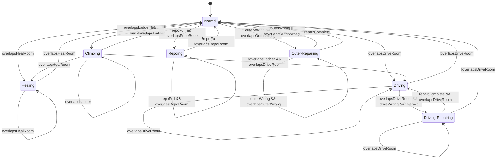

# GameJam Phaser

基于 Phaser、TypeScript 和 Vite 的双玩家飞船场景原型。主入口是 `src/main.ts`，页面入口是 `index.html`。

## 技术栈

- Phaser
- TypeScript
- Vite

## 常用命令

```bash
npm install
npm run dev
npm run build
npm run preview
```

`npm run build` 会先执行 TypeScript 类型检查，再执行 Vite 生产构建。当前构建可能出现 Vite chunk size 警告，这是既有警告。

## 目录结构

```text
.
├── assets/
│   ├── scene/              # 场景、房间、物理标记图、陨石、Alien 等资源
│   ├── Sprite/             # 爆炸和 PowerCrystal 序列帧
│   ├── VFX/                # 火焰、警告图标等特效
│   ├── player-prefab/      # Unity Player.prefab 拆出的玩家贴图和 handTool
│   └── Sound/              # BGM 与音效资源
├── src/
│   ├── main.ts             # 主场景和全部游戏逻辑
│   ├── style.css
│   └── vite-env.d.ts
├── index.html
├── package.json
└── vite.config.ts
```

## 场景图层

当前场景尺寸为 `1672x941`。

主要图层从下到上：

- 星空背景：`assets/scene/spaceBg/星空1.png` 与 `星空2.png` 循环切换。
- 星空前景：`assets/scene/spaceBg/spaceE.png`。
- 下方随机陨石和上方破坏陨石。
- 飞船火焰层：`assets/VFX/fireV.png`，UI 控制显示隐藏，并以 `5s` 为周期向右移动 `50px` 后返回。
- 飞船主体：`assets/scene/spaceShip.png`。
- 房间图层：由 `ROOM_CONFIGS` 加载。
- 外部损坏层：`assets/scene/ShipRoom/OuterWrong.png`，默认隐藏。
- Drive 和上方陨石警告图标：`warningSign.png`、`warningSignRock.png`。
- PowerCrystal、玩家、Alien、生命条、进度条、UI。

## 房间系统

房间配置集中在 `ROOM_CONFIGS`。每个配置包含 `id`、`label`、`defaultTextureKey`、`maskTextureKey` 和 `layerOptions`。

当前房间：

- `Drive`：`drive.png` / `driveFire.png`，可在 `Normal` 和 `Wrong` 间切换。
- `Heal`：`heal.png`，玩家进入 alpha mask 后进入 `Healing`。
- `LeftUpRoom`：`LeftUpRoom.png`，当前只显示。
- `Workshop`：`workshop.png`，当前只显示。
- `Living`：`living.png`，当前只显示。
- `Plant`：`plant.png`，当前只显示。
- `Tube`：`Tube.png`，当前只显示。
- `Power`：`Power.png`，当前只显示。
- `Repo`：`RepoFull.png` / `RepoEmpty.png`，默认 `Full`，UI 可切换。
- `OuterWrong`：不是 `ROOM_CONFIGS` 房间，使用 `isOuterWrong` 管理显示和损坏状态。

房间贴图会额外生成 alpha mask 写入 `roomMasks`，用于状态检测，不参与实体阻挡。

`OuterWrong.png` 也会生成 `outerWrong` mask，用于检测玩家进入损坏区域。

## 物理系统

项目使用手写像素级物理系统，不使用 Phaser Arcade Physics。

当前物理图：

- `assets/scene/physic.png`：飞船内部物理图。
- `assets/scene/physicOut.png`：飞船外部物理图。

颜色语义：

- `#FFFFFF`：实体碰撞层，会阻挡玩家和 Alien。
- `#FF0000`：梯子触发层，只在 `physic.png` 中使用，不阻挡移动。
- 透明像素或其他颜色：忽略。

运行时数据：

- `collisionData`：`physic.png` 的白色阻挡层。
- `ladderData`：`physic.png` 的红色梯子层。
- `outsideCollisionData`：`physicOut.png` 的白色阻挡层。
- `roomMasks`：房间和 `outerWrong` 的 alpha mask。

移动规则：

- 玩家使用包围盒采样，采样步长为 `4px`。
- 移动按 X/Y 分轴处理，允许沿墙滑动。
- 玩家在飞船内部时采样 `physic.png`。
- 玩家在飞船外部时采样 `physicOut.png`。
- 场景外默认不可通行。
- Player1 在普通状态下可尝试最多 `24px` 的自动上台阶。

## 双玩家

当前有两个玩家，逻辑互相独立但共用同一套状态机规则。

Player1：

- 初始位置在飞船内部。
- 使用 `WASD` 移动。
- 使用 `E` 互动。
- 使用 `playerHealth`、`playerProgress`、`playerState`。
- 使用 `isGravityEnabled`、`playerVelocityY`、`isPlayerInsideShip`。

Player2：

- 初始位置为飞船外部 `X=900, Y=100`。
- 使用方向键移动。
- 使用 `L` 互动。
- 使用 `secondPlayerHealth`、`secondPlayerProgress`、`secondPlayerState`。
- 使用 `isSecondPlayerGravityEnabled`、`secondPlayerVelocityY`、`isSecondPlayerInsideShip`。

两名玩家都拥有：

- 隐藏逻辑胶囊体。
- 独立 prefab 视觉层。
- 独立生命值和生命条。
- 独立圆形进度条。
- 独立动画状态。
- 独立手持装备状态。
- 独立飞船内外状态。
- 独立重力和垂直速度。
- 独立 Swap 后惯性状态。

两名玩家共用：

- `playerStateTransitions` 状态机转换表。
- 房间 alpha mask 检测逻辑。
- 梯子检测逻辑。
- Heal 回血逻辑。
- Drive 进入与修理逻辑。
- Repo 获取灭火器逻辑。
- Outer 修理逻辑。
- 资源拾取逻辑。
- Alien 受击逻辑入口。

## 玩家生命值和速度

常量：

- 生命上限：`100`
- 基础移动速度：`260px/s`
- 重力：`1100`
- 最大下落速度：`900`
- Heal 回复速度：`15/s`

血量会影响移动速度：

```ts
speedMultiplier = clamp(1 - missingHealth / 200, 0.55, 1)
```

Player1 使用 `getPlayerHealthSpeedMultiplier()`。

Player2 使用 `getSecondPlayerHealthSpeedMultiplier()`。

生命值归零后会改变隐藏逻辑胶囊体颜色，但视觉 prefab 仍保留。

## 玩家状态机

状态列表：

- `Normal`
- `Climbing`
- `Healing`
- `Driving`
- `Driving-Repairing`
- `Repoing`
- `Outer-Repairing`

Player1 通过 `updatePlayerState()` 更新。

Player2 通过 `updateSecondPlayerState()` 更新。

两者共用 `playerStateTransitions`，区别只在输入键不同：Player1 是 `E`，Player2 是 `L`。



### Normal

- 重力开启。
- 白色碰撞开启。
- 可进入 Heal、Drive、Repo、Outer 修理状态。
- 接触梯子并按纵向输入时进入 `Climbing`。

### Climbing

- 重力关闭。
- 白色碰撞关闭。
- 横向移动仍可用。
- Player1 用 `W/S` 进入，Player2 用 `↑/↓` 进入。
- 离开梯子区域后回到 `Normal`。

### Healing

- 进入 Heal 房间 mask 后进入。
- 每秒回复 `15` 点生命值。
- 生命值不超过 `100`。
- 离开 Heal 后回到 `Normal`。

### Driving

- 进入 Drive 房间 mask 后进入。
- 如果 Drive 是 `Wrong`，按互动键进入 `Driving-Repairing`。
- Player1 按 `E`，Player2 按 `L`。

### Driving-Repairing

- 显示玩家自己的圆形进度条。
- 按住互动键以 `20%/s` 增加进度。
- 修满后调用 `setDriveRoomOption('Normal')`。
- 进度归零，状态回到 `Driving` 或 `Normal`。

### Repoing

- Repo 是 `Full` 且玩家进入 Repo mask 后进入。
- 显示玩家自己的圆形进度条。
- 按住互动键以 `50%/s` 增加进度。
- 修满后执行“获取灭火器”。
- Player1 调用 `acquireFireExtinguisher()`。
- Player2 调用 `acquireSecondPlayerFireExtinguisher()`。
- Repo 切换为 `Empty`，当前玩家手持装备切为 `Extinguisher`，进度归零。

### Outer-Repairing

- `isOuterWrong === true` 且玩家进入 `OuterWrong.png` mask 后进入。
- 显示玩家自己的圆形进度条。
- 自动以 `10%/s` 修理，不需要按互动键。
- Player1 使用 `playerProgress`。
- Player2 使用 `secondPlayerProgress`。
- 修满后调用 `setOuterWrong(false)`，效果等同 UI 的 Outer Repair。
- 修复后隐藏 `OuterWrong.png`，关闭雪花噪音，UI 回到 `Normal`。

## Swap

左侧 `Controls` 面板中的 `Teleport` 按钮实际文本为 `Swap`。

点击后：

- 交换 Player1 和 Player2 的坐标。
- 交换飞船内外状态。
- 交换重力状态。
- 清空两名玩家垂直速度。
- 根据 Swap 前的移动输入给两名玩家施加短暂惯性。
- 惯性速度为 `500`，持续 `1000ms`，会逐渐衰减。
- 刷新 prefab、生命条、进度条、坐标 UI 和碰撞调试框。

## Outer 损坏和雪花噪音

上方破坏陨石触发时会调用 `onPixelAsteroidLaneReachedTriggerX(...)`。

触发效果：

- 输出 `上面陨石撞到了飞船`。
- 调用 `setOuterWrong(true)`。
- 显示 `OuterWrong.png`。
- 显示雪花噪音覆盖层。
- 播放爆炸动画。

雪花噪音：

- 使用运行时生成的 `snow-noise-texture`。
- 包含 `snowNoiseBaseLayer` 和 `snowNoiseOverlay` 两层。
- `createSnowNoiseOverlay(...)` 是幂等的，已有图层时不会重复创建。
- `setOuterWrong(true)` 是幂等的，已经损坏时不会重复打开，避免噪音叠加。

进入检测：

- `OuterWrong.png` 会生成 `outerWrong` alpha mask。
- Player1 第一次进入时输出 `Player1进入OuterWrong区域`。
- Player2 第一次进入时输出 `Player2进入OuterWrong区域`。
- 离开后再次进入会再次触发。

## 手持装备

资源目录：`assets/player-prefab/handTool/`

当前装备：

- `None`：默认，手上不显示工具。
- `Bow`：`bow.png`。
- `Extinguisher`：`fireExtinguisher.png`。

两名玩家的手持装备互相独立。

Player panel 中的 `Hand Tool` 按钮会循环切换当前玩家自己的装备。

Repo 获取灭火器完成后，当前玩家自动切换为 `Extinguisher`。

## prefab 视觉和动画

玩家视觉来自 Unity `Player.prefab` 的分层贴图复刻。

逻辑胶囊体默认隐藏，负责移动、碰撞、状态、生命条和进度条锚点。

prefab 视觉层负责显示和动画，不参与物理碰撞。

当前动画：

- `Idle`
- `Walk`
- `Run`
- `Attack`
- `Jump`
- `Dance`
- `Stun`
- `Defeat`

两名玩家都有独立动画节点和动画时间。

Player panel 中的 `Animation` 按钮只切换对应玩家的动画。

浏览器控制台仍可调用 Player1 的动画接口：

```js
window.playPlayerAnimation('Idle')
window.getPlayerAnimationState()
```

## 陨石和资源

下方随机陨石：

- 生成间隔：`300~1600ms`。
- Y 范围：`840~1000`。
- 速度：`80~220px/s`。
- 缩放：`0.7~1.5`。
- 从右向左移动。

资源池：

- `asteroid_grey_tiny.png`
- `asteroid_tiny.png`
- `pixel_asteroid.png`
- `金属碎片.png`
- `冰晶.png`

资源碰撞：

- `金属碎片.png` 和 `冰晶.png` 不阻挡玩家。
- Player1 和 Player2 都可以拾取。
- 每个资源陨石只触发一次。
- `金属碎片.png` 命中时输出 `获取到金属碎片资源`。
- `冰晶.png` 命中时输出 `获取到冰晶资源`。
- `metalDebrisCount` 和 `iceCrystalCount` 记录 Controls 面板中的资源数量。
- `resourceCounts` 和顶部资源计数 UI 记录带上限的资源显示，当前上限为 `3`。

## 上方破坏陨石和爆炸

上方破坏轨道：

- 只使用 `pixel_asteroid.png`。
- Y 范围：`100~140`。
- 生成间隔：`7000~18000ms`。
- 预警提前时间：`3000ms`。
- 触发 X 坐标：`650`。

流程：

- 生成前 `warningSignRock.png` 闪烁。
- 陨石进入画面后隐藏 warning。
- 陨石到达 `x <= 650` 后触发爆炸和 Outer 损坏。
- 触发后销毁该陨石。

爆炸动画：

- 使用 `assets/Sprite/explosion/explosion1.png` 到 `explosion8.png`。
- 动画 key：`explosion-test`。
- 播放完自动销毁。

## PowerCrystal

PowerCrystal 使用独立序列帧：

- `assets/Sprite/Crystal Drain-cached-frames/frame_001.png`
- 到 `frame_016.png`

显示参数：

- PS 坐标按左上角解释：`X=814, Y=645`。
- Phaser sprite 实际中心点：`X=850, Y=685`。
- 显示尺寸：`72x80`。
- 默认显示第一帧。
- UI 中的 `Crystal` 按钮播放一次动画，结束后回到第一帧。

## Alien

Alien 资源：

- `assets/scene/Alien/外星人.png`
- `assets/scene/Alien/瞄准.png`

核心参数：

- 生成间隔：`2200~5200ms`。
- 移动速度：`155px/s`。
- 接触伤害：`25`。
- 击退力：`2400`。
- 屏幕外边距：`90px`。
- 每次最多存在一个 alien。

目标规则：

- Alien 生成时锁定当时处于飞船外部的玩家。
- 目标写入 `alien.targetPlayer`。
- Swap 后不重新选目标。
- 即使目标被 Swap 到飞船内部，Alien 仍继续追踪同一个玩家对象。

移动和碰撞：

- Alien 沿直线追踪锁定目标。
- 准星显示在锁定目标坐标上。
- Alien 使用 `physicOut.png` 的外部碰撞层。
- 从屏幕外进入时允许越过边界，进入场景后按外部碰撞阻挡。
- 接触后进入击退状态，击退速度每帧乘以 `0.9` 衰减。
- 击退速度低于 `20` 后恢复追踪。

伤害：

- 命中 Player1 时调用 `damagePlayer(25)`。
- 命中 Player2 时调用 `onSecondPlayerAlienContact(25)`，内部扣 Player2 血。
- 玩家和 Alien 分离后可再次造成伤害。

## BGM 和音频

当前 BGM：

- `assets/Sound/BGM/HOYO-MiX - 危机预知 Crises.mp3`

BGM 默认静音。

`BGM` 按钮可切换静音和播放。

当前代码中还存在未跟踪或新增的 BGM wav 资源，是否纳入正式资源取决于后续需求。

## UI

左侧原始面板：`Controls`

- `Teleport` / `Swap`：交换两个玩家位置、内外状态和重力状态。
- `Resources`：显示 `金属碎片` 和 `冰晶` 数量。
- `Scene`：场景调试和房间开关。
- `Utility`：工具按钮。

右侧玩家面板：

- `Player1`
- `Player2`

两个玩家面板结构一致：

- `Position`
- `Area`
- `Gravity`
- `State`
- `Animation` 按钮
- `Progress` slider
- `Hand Tool` 按钮

右下角操作说明：

- 表格形式。
- P1 移动：`W A S D`。
- P1 互动：`E`。
- P2 移动：`← ↑ ↓ →`。
- P2 互动：`L`。

快捷键：

- `H`：显示或隐藏左侧 Controls 面板。

Scene 分组：

- `BGM`：切换静音或播放。
- `Collision`：显示或隐藏碰撞调试层。
- `Ship Fire`：显示或隐藏 `fireV.png`。
- `Drive`：切换 `Normal` / `Wrong`。
- `Outer`：损坏时显示 `Repair`，点击后修复。
- `Repo`：切换 `Full` / `Empty`。
- `Crystal`：播放 PowerCrystal 动画。

Utility 分组：

- `Screenshot`：导出当前游戏 canvas 为 PNG。

截图说明：

- WebGL 开启 `preserveDrawingBuffer`。
- 截图逻辑会等待下一帧后导出，避免黑图。

## 碰撞调试

`Collision` 按钮会显示：

- `physic.png` 生成的调试图层。
- 白色实体区域显示为半透明红色。
- 红色梯子区域显示为偏橙半透明颜色。
- Player1 碰撞体：蓝色矩形。
- Player2 碰撞体：紫色矩形。
- 金属碎片碰撞体：黄色矩形。
- 冰晶碰撞体：青色矩形。

该图层只用于调试观察，不参与实际渲染素材本身。

## 开发提示

主要修改位置：

- `src/main.ts`：主场景、资源加载、玩家、状态机、UI、物理、敌人、陨石。
- `src/style.css`：页面和 canvas 样式。
- `assets/`：场景、玩家、音频和特效资源。

当前实现重点：

- 双玩家应该优先保持逻辑对称。
- 两名玩家只应该在输入键、独立数值和独立视觉实例上不同。
- 新增房间交互时优先接入共享状态机上下文。
- 新增玩家进度逻辑时应同时考虑 `playerProgress` 和 `secondPlayerProgress`。
- `physic.png` 只用于飞船内部，`physicOut.png` 只用于飞船外部。
