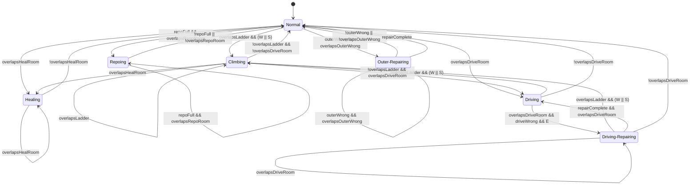

# GameJam Phaser

一个基于 Phaser、TypeScript 和 Vite 的游戏项目。

## 项目说明

当前项目使用 Phaser 创建游戏场景，通过 Vite 提供开发服务器和生产构建。游戏入口位于 `src/main.ts`，页面入口位于 `index.html`。

当前场景使用 `assets/scene/spaceBg/星空1.png` 与 `assets/scene/spaceBg/星空2.png` 循环切换作为底层星空背景，并叠加 `assets/scene/spaceBg/spaceE.png`、动态陨石层、飞船图层和房间图层。玩家逻辑仍使用一个隐藏的胶囊形 `Graphics` 对象作为移动和碰撞锚点，实际显示层使用 Unity `Player.prefab` 复刻出的分层 2D 角色。

## 技术栈

- Phaser 4
- TypeScript
- Vite

## 目录结构

```text
.
├── assets/          # 游戏资源
│   ├── scene/       # 场景图、覆盖层和物理标记图
│   ├── Sprite/      # 序列帧和精灵动画资源
│   ├── VFX/         # 警告图标等特效资源
│   ├── player-prefab/ # 从 Unity prefab 复制出的玩家分层贴图
│   └── Sound/       # 音频资源
├── src/
│   ├── main.ts      # 游戏入口和主场景
│   ├── style.css    # 全局样式
│   └── vite-env.d.ts
├── index.html       # 页面入口
├── package.json     # 项目脚本和依赖
└── vite.config.ts   # Vite 配置
```

## 安装依赖

```bash
npm install
```

## 本地开发

```bash
npm run dev
```

开发服务器默认会监听 `0.0.0.0`，方便在局域网设备中访问。

## 构建项目

```bash
npm run build
```

该命令会先运行 TypeScript 类型检查，然后使用 Vite 生成生产构建文件。

## 预览构建结果

```bash
npm run preview
```

## 资源路径

游戏资源放在 `assets/` 目录中，可以在 Phaser 中通过绝对路径加载，例如：

```ts
this.load.image('background', '/assets/scene/spaceShip.png');
```

## 场景与房间

### 图层顺序

当前主要图层从下到上大致为：

- 星空背景：`spaceBg/星空2.png` 与 `spaceBg/星空1.png` 循环切换。
- 星空前景：`spaceBg/spaceE.png`。
- 动态陨石层：运行时随机生成。
- 飞船火焰层：`VFX/fireV.png`，由 UI 手动显示或隐藏，并以 5 秒为周期在 X 轴向右 50px 后返回。
- 飞船主体：`spaceShip.png`。
- 房间图层：`heal.png`、`LeftUpRoom.png`、`workshop.png`、`living.png`、`plant.png`、`Tube.png`、`Power.png`、`RepoFull.png` 或 `RepoEmpty.png`、`drive.png` 或 `driveFire.png`。
- 外部损坏层：`OuterWrong.png`，默认隐藏，上层陨石命中后显示。
- 警告图标：`warningSign.png`、`warningSignRock.png`。
- 玩家、玩家 UI、调试 UI。

### 房间配置

房间数据集中在 `src/main.ts` 的 `ROOM_CONFIGS` 中。每个房间包含：

- `id`：房间唯一标识。
- `label`：UI 显示名称。
- `defaultTextureKey`：默认显示贴图。
- `maskTextureKey`：用于 alpha mask 区域检测的贴图。
- `layerOptions`：房间状态选项和资源路径。

当前房间：

- `Drive`：包含 `Normal` 和 `Wrong` 两种状态，UI 按钮可在二者之间切换。`Wrong` 使用 `driveFire.png`，并显示闪烁的 `warningSign.png`。
- `Heal`：使用 `heal.png`，玩家进入该房间 alpha mask 后进入 `Healing` 状态。
- `LeftUpRoom`：使用 `LeftUpRoom.png`，当前只作为房间图层显示。
- `Workshop`：使用 `workshop.png`，当前只作为房间图层显示。
- `Living`：使用 `living.png`，当前只作为房间图层显示。
- `Plant`：使用 `plant.png`，当前只作为房间图层显示。
- `Tube`：使用 `Tube.png`，当前只作为房间图层显示。
- `Power`：使用 `Power.png`，当前只作为房间图层显示。
- `Repo`：右下角房间，包含 `Full` 和 `Empty` 两种状态，默认显示 `RepoFull.png`，UI 按钮可切换为 `RepoEmpty.png`。
- `OuterWrong`：使用 `OuterWrong.png`，不是 `ROOM_CONFIGS` 房间，使用 `isOuterWrong` 变量记录状态。上层陨石命中飞船后显示，UI 的 `Outer` 按钮可修复并隐藏。运行时会额外为 `OuterWrong.png` 生成 alpha mask，用于检测玩家进入该区域。

### 陨石与特效

当前有两条陨石轨道：

- 下方随机轨道：Y 范围当前为 `840~1000`，从右向左飞行，资源池包含普通陨石、`金属碎片.png` 和 `冰晶.png`。
- 上方破坏轨道：Y 范围为 `100~140`，只使用 `pixel_asteroid.png`。

上方破坏轨道规则：

- 距离上方陨石生成还有 `3s` 时，`warningSignRock.png` 开始闪烁。
- 当上方陨石进入画面后，`warningSignRock.png` 隐藏。
- 当上方陨石 `x <= 650` 时，调用 `onPixelAsteroidLaneReachedTriggerX(...)`，陨石对象销毁，并播放爆炸动画。
- 爆炸动画使用 `assets/Sprite/explosion/explosion1.png` 到 `explosion8.png` 八张独立图片顺序播放，不使用精灵图。
- `PowerCrystal` 动画使用 `assets/Sprite/Crystal Drain-cached-frames/frame_001.png` 到 `frame_016.png` 十六张独立图片顺序播放。PS 设计坐标 `X=814, Y=645` 按左上角解释，Phaser sprite 实际中心点为 `X=850, Y=685`，显示尺寸为 `72x80`。UI 的 `Crystal` 按钮会从第一帧开始播放一次，结束后回到第一帧。
- 上方陨石命中触发后会把 `isOuterWrong` 设置为 `true`，并显示 `OuterWrong.png`。

下方特殊素材规则：

- `金属碎片.png` 与 `冰晶.png` 固定 `alpha = 1`，不使用随机透明度。
- `金属碎片.png` 与 `冰晶.png` 不阻挡玩家移动，只做非阻挡资源碰撞检测。
- Player1 或 Player2 碰到特殊陨石都会触发资源获取逻辑。
- `金属碎片.png` 命中时输出 `获取到金属碎片资源`。
- `冰晶.png` 命中时输出 `获取到冰晶资源`。
- 全局资源数量由 `metalDebrisCount` 和 `iceCrystalCount` 记录，命中对应资源后数量加 1。
- 左上角 Controls 面板中的 `Resources` 区域会显示当前 `金属碎片` 和 `冰晶` 数量。
- 每个特殊陨石对象对玩家碰撞只触发一次，触发后通过 `hasTriggeredPlayerCollision` 防止重复输出。

### Alien 追踪敌人

场景中还有一个 alien 追踪敌人系统，资源位于 `assets/scene/Alien/`：

- `外星人.png`：alien 本体贴图，运行时显示尺寸为 `70x70`。
- `瞄准.png`：目标准星，显示尺寸为 `40x40`，有 alien 存在时显示在当前目标位置。

Alien 生成时会锁定“当时处于飞船外部的玩家”作为目标，之后即使两个玩家 Swap 导致目标进入飞船内部，alien 也会继续追踪同一个玩家对象，不会重新选择目标。核心参数：

- 生成间隔：`2200~5200ms`。
- 移动速度：`155px/s`。
- 碰撞距离：`ALIEN_HIT_DISTANCE + hitRadius`，当前为 `36 + 22`。
- 接触伤害：`25`。
- 击退力：`2400`。
- 屏幕外生成/销毁边距：`90px`。

运行规则：

- 每次最多只存在一个 alien；只有 `alienSprites.length === 0` 时才会生成新的 alien。
- 生成时通过 `getOutsidePlayerId()` 判断当前飞船外部玩家，并保存到 `alien.targetPlayer`。
- 生成位置从屏幕上方、左侧或右侧随机选择，并放在屏幕外 `90px` 处。
- 每帧通过 `alien.targetPlayer` 取得锁定目标，并沿直线靠近该目标。
- Alien 会旋转朝向锁定目标，准星会跟随显示在锁定目标坐标上。
- Alien 的正常追踪移动和击退移动都会使用飞船外部碰撞层 `physicOut.png`，语义与飞船外部玩家一致，只采样白色 `#FFFFFF` 作为阻挡。
- Alien 从屏幕外生成进入画面时允许先越过场景边界；进入场景后再按 `physicOut.png` 阻挡。
- 接触锁定目标时，如果本次接触尚未造成过伤害，则调用 `damageAlienTarget(...)`。
- 如果锁定目标是 Player1，`damageAlienTarget(...)` 会调用 `damagePlayer(25)`；如果锁定目标是 Player2，会通过 `onSecondPlayerAlienContact(...)` 调用 Player2 的扣血逻辑。
- 接触后 alien 会进入 `repelledByHit` 击退状态，沿远离锁定目标的方向被推出；击退速度每帧乘以 `0.9` 衰减。
- 击退速度低于 `20` 后退出击退状态，恢复追踪。
- 玩家和 alien 分离后，`alienDamageStates` 会重置为 `false`，下次接触可以再次造成伤害。
- Alien 离开屏幕外边距后会被销毁，并重置下一次生成计时。

`damagePlayer(...)` 当前影响 Player1：扣除生命值、刷新生命条，并在生命值小于等于 0 时改变隐藏逻辑胶囊体颜色。Player2 使用独立的 `secondPlayerHealth` 和生命条，alien 接触 Player2 时会扣除 Player2 生命值并刷新 Player2 生命条。

## 物理系统

项目当前使用两张像素级物理标记图。它们不会直接显示在游戏场景中，而是在运行时通过 Canvas 读取像素数据，并转换成用于碰撞和状态检测的数据层。

- `assets/scene/physic.png`：只对处于飞船内部的玩家有效。
- `assets/scene/physicOut.png`：只对处于飞船外部的玩家有效。

两张物理图的尺寸应与主场景图一致，目前为 `1672x941`。由于它们与 `spaceShip.png`、房间覆盖图和主要场景图尺寸一致，可以直接使用场景坐标进行像素采样，不需要额外坐标换算。

### 颜色语义

- `#FFFFFF`：实体碰撞层。玩家在启用白色碰撞检测时不能穿过该区域；`physicOut.png` 当前只使用该颜色作为飞船外部阻挡。
- `#FF0000`：梯子触发层。该区域本身不阻挡玩家移动，用于检测玩家是否进入爬梯状态；该语义只用于 `physic.png`。
- 房间自身贴图 alpha mask：用于房间区域状态检测，例如 `drive.png` 的非透明像素用于检测玩家是否进入 `Driving` 状态；该 mask 不阻挡玩家移动。
- 透明像素或其他颜色：无物理语义，默认忽略。

读取像素时会忽略 alpha 过低的像素，当前阈值为：

```ts
const COLLISION_ALPHA_THRESHOLD = 16;
```

### 数据生成

运行时会把 `physic.png` 拆成两个 `Uint8Array` 数据层：

- `collisionData`：由 `#FFFFFF` 像素生成，用于实体阻挡。
- `ladderData`：由 `#FF0000` 像素生成，用于梯子区域检测。

运行时也会把 `physicOut.png` 拆成 `outsideCollisionData`，只采样 `#FFFFFF` 像素作为飞船外部实体阻挡。

房间 alpha mask 会额外生成到 `roomMasks` 中。它们只用于房间状态检测，例如 Drive、Heal、LeftUpRoom、Workshop、Living、Plant、Tube、Power、Repo 的进入区域判断，不会参与 `collidesWithMap(...)` 的阻挡逻辑。`OuterWrong.png` 也会以 `outerWrong` mask 形式写入 `roomMasks`，用于进入检测。

核心语义等价于：

```ts
collisionData[index] = r === 255 && g === 255 && b === 255 ? 1 : 0;
ladderData[index] = r === 255 && g === 0 && b === 0 ? 1 : 0;
```

### 碰撞检测

玩家当前是一个胶囊形显示对象，但物理检测使用玩家包围盒进行采样。检测时会在玩家包围盒内部和边缘按固定步长采样像素，目前采样步长为 `4` 像素。

玩家的视觉胶囊体默认隐藏；实际功能锚点仍保留，用于移动、白色碰撞、梯子检测、房间检测、生命条和进度条跟随。

移动时采用 X/Y 分轴处理：

- 先尝试 X 轴移动，如果目标位置碰撞则取消 X 轴位移。
- 再尝试 Y 轴移动，如果目标位置碰撞则取消 Y 轴位移。
- 这种方式允许玩家沿墙滑动，行为类似常见角色控制器。

玩家移动时会先根据自身当前处于飞船内部还是外部选择对应物理图。`Swap` 交换两个玩家位置时，也会交换两名玩家的内外状态和重力状态。

场景边界外默认视为不可通行。

### 玩家状态机

当前玩家状态有七个：

- `Normal`
- `Climbing`
- `Healing`
- `Driving`
- `Driving-Repairing`
- `Repoing`
- `Outer-Repairing`

当前 `updatePlayerState()` 的状态转换：



代码实现上，状态转换已拆成显式状态机：`playerStateTransitions` 按当前 `PlayerState` 分发到对应 transition handler，`createPlayerStateTransitionContext(...)` 统一采集梯子、房间、RepoFull、OuterWrong、维修输入等条件，`transitionPlayerState(...)` 负责执行离开旧状态和应用新状态。

`Normal` 状态规则：

- 重力开启。
- 白色 `#FFFFFF` 碰撞检测开启。
- 红色 `#FF0000` 区域不阻挡玩家移动。
- 玩家接触红色区域并按下 `W` 或 `S` 时，切换到 `Climbing`。

`Climbing` 状态规则：

- 重力关闭。
- 白色 `#FFFFFF` 碰撞检测关闭。
- `A` / `D` 仍然响应，允许左右移动。
- 已处于 `Climbing` 时，只要下一帧仍接触红色 `#FF0000` 区域，就保持 `Climbing`，不再要求持续按 `W` 或 `S`。
- 玩家离开红色 `#FF0000` 区域时，切回 `Normal`。

`Healing` 状态规则：

- 玩家从 `Normal` 或 `Climbing` 进入 Heal 房间 alpha mask 区域时切换到该状态。
- 在 `Healing` 中生命值以 `15/s` 增加，最高不超过 `100`。
- 玩家离开 Heal 房间时切回 `Normal`。

`Driving` 状态规则：

- 玩家进入 Drive 房间 alpha mask 区域时切换到该状态。
- Drive mask 只用于状态检测，不阻挡玩家移动。
- 玩家离开 Drive mask 区域时切回 `Normal`。
- 当 Drive 房间处于 `Wrong` 状态时，在 `Driving` 状态下按 `E` 会进入 `Driving-Repairing`。

`Driving-Repairing` 状态规则：

- 玩家进度条在该状态下显示，其他状态默认隐藏。
- 按住 `E` 会以每秒 20% 的速度增加维修进度。
- 维修进度满时，进度归零并隐藏，Drive 房间状态从 `Wrong` 切回 `Normal`。

`Repoing` 状态规则：

- 玩家处于 `Normal` 且 Repo 房间处于 `Full` 时，进入 Repo 房间 alpha mask 区域会切换到该状态。
- 玩家保持在 `RepoFull` 区域内时持续 `Repoing`。
- 玩家进度条在该状态下显示，按住 `E` 会以每秒 50% 的速度增加进度。
- 进度满时执行“获取灭火器”行为：调用 `acquireFireExtinguisher()`，将 Repo 切换为 `Empty`，玩家手持装备切换为 `Extinguisher`，玩家状态切回 `Normal`，进度归零并隐藏进度条。
- 玩家离开 Repo 房间，或 Repo UI 切换到 `Empty` 后，切回 `Normal`。

`Outer-Repairing` 状态规则：

- Player1 或 Player2 处于 `Normal`，`isOuterWrong === true`，且进入 `OuterWrong.png` alpha mask 区域时切换到该状态。
- 玩家保持在损坏的 OuterWrong 区域内时持续 `Outer-Repairing`。
- 玩家圆形进度条在该状态下显示，修理速度为每秒 `10%`，不需要按住互动键。
- Player1 使用 `playerProgress`，Player2 使用 `secondPlayerProgress`；除此之外 Outer 修理进度逻辑一致。
- Player1 修理完成时调用 `repairOuterFromPlayer()`，Player2 修理完成时调用 `repairOuterFromSecondPlayer()`，内部都复用 `setOuterWrong(false)`，效果与 UI 中 `Outer` 的 `Repair` 按钮一致：隐藏 `OuterWrong.png`，UI 切回 `Normal`，玩家状态切回 `Normal`，进度归零并隐藏进度条。
- 玩家离开 OuterWrong 区域，或 Outer 已被修复后，切回 `Normal`。

其他状态相关规则：

- `isOuterWrong` 记录飞船外部是否损坏。上层陨石触发爆炸后会设置为 `true`，并显示 `OuterWrong.png`。
- UI 中的 `Outer` 按钮在 `isOuterWrong === true` 时显示为红色 `Repair`，点击后设置为 `false` 并隐藏 `OuterWrong.png`。
- Outer 损坏时会显示雪花噪音覆盖层。雪花噪音图层创建是幂等的：如果 `snowNoiseBaseLayer` 和 `snowNoiseOverlay` 已存在，就不会再次创建；如果 `isOuterWrong` 已经是 `true`，重复破坏不会再次触发噪音显示逻辑，避免图层叠加。
- Player1 或 Player2 第一次进入 `OuterWrong.png` alpha mask 区域时会分别输出 `Player1进入OuterWrong区域` 或 `Player2进入OuterWrong区域`，离开后再次进入会再次触发。
- Drive 的 UI 控件现在是按钮，不是下拉菜单。点击按钮在 `Normal` 和 `Wrong` 之间切换。
- Repo 的 UI 控件是按钮，点击按钮在 `Full` 和 `Empty` 之间切换。

UI 中的 `Player State` 会显示当前状态。

## 玩家渲染与动画

主玩家当前由两部分组成：

- 隐藏胶囊体：`Phaser.GameObjects.Graphics`，只作为移动、碰撞、梯子检测和状态机坐标锚点。
- prefab 视觉层：由 `assets/player-prefab/` 下的多张 PNG 组合成分层角色，跟随隐藏胶囊体坐标移动。

两名玩家上方都有生命条：

- 默认生命值为 `100`。
- 生命值上限为 `100`。
- `Healing` 状态下以 `15/s` 回复。
- Player1 使用 `playerHealth` 和 `playerHealthBar`。
- Player2 使用 `secondPlayerHealth` 和 `secondPlayerHealthBar`。
- 两名玩家都会根据自身血量降低移动速度：速度倍率为 `1 - missingHealth / 200`，并限制在 `55%~100%`。
- Player1 使用 `getPlayerHealthSpeedMultiplier()`，Player2 使用 `getSecondPlayerHealthSpeedMultiplier()`。

玩家右上角有圆形维修进度条：

- 默认隐藏。
- 进入 `*-Repairing` 或 `Repoing` 状态时显示。
- 当前 `Driving-Repairing` 中按住 `E` 以每秒 `20%` 增加。
- 当前 `Repoing` 中按住 `E` 以每秒 `50%` 增加。

视觉层来源于 Unity 的 `Player.prefab`，当前复刻了可见部件，包括身体、头、头发、眼睛、胸甲、手持装备和箭矢等。角色默认朝右，水平移动时会根据 `A` / `D` 输入翻转视觉层；该翻转只影响显示，不影响碰撞体和物理逻辑。

### 双玩家控制

当前场景中有两个独立玩家：

- `Player1`：初始在飞船内部，使用 `WASD` 移动，`E` 互动。它参与现有状态机、生命条、房间交互、维修/Repo 进度、手持装备和 alien 伤害机制。
- `Player2`：初始在飞船外部 `X=900, Y=100`，使用方向键移动，`L` 是他的互动键。`onSecondPlayerInteract()` 当前为空函数，预留后续交互。

两名玩家的独立数据：

- 各自有逻辑胶囊体锚点和 prefab 视觉层。
- 各自有飞船内/外状态：`isPlayerInsideShip`、`isSecondPlayerInsideShip`。
- 各自有重力状态和垂直速度：`isGravityEnabled` / `playerVelocityY`，`isSecondPlayerGravityEnabled` / `secondPlayerVelocityY`。
- 各自有可交互 UI panel，包含 `Animation` 按钮、`Progress` slider 和 `Hand Tool` 按钮。
- `Player1` 的 `Progress` 会参与真实维修/Repo/Outer 修理逻辑；`Player2` 的 `Progress` 会参与自己的 Outer 修理逻辑，也可通过 UI slider 独立调整显示值。
- `Player1` 和 `Player2` 都可以切换 prefab 动画和手持装备；这些视觉状态彼此独立。

移动和碰撞：

- `Player1` 使用 `WASD`，`Player2` 使用方向键。
- 两名玩家都按 X/Y 分轴移动并采样对应物理图。
- 处于飞船内部的玩家使用 `physic.png`，处于飞船外部的玩家使用 `physicOut.png`。
- `physicOut.png` 当前只采样白色 `#FFFFFF` 作为外部阻挡。
- `Player1` 在飞船内部仍可进入房间状态机；`Player2` 当前不参与普通房间状态机，但会参与 OuterWrong 区域的 `Outer-Repairing` 修理状态。

Swap 机制：

- 原调试面板中的 `Teleport` 按钮现在显示为 `Swap`。
- 点击后交换 Player1 和 Player2 的坐标。
- 同时交换两名玩家的飞船内/外状态和重力状态。
- 交换后两名玩家的垂直速度清零，并刷新 prefab 视觉、生命条、进度条、坐标 UI 和碰撞调试框。

碰撞调试开启时，Player1 逻辑碰撞体显示为蓝色矩形，Player2 逻辑碰撞体显示为紫色矩形。

### 手持装备

玩家手持装备资源集中在 `assets/player-prefab/handTool/`。当前默认状态为 `None`，表示手里什么都不拿。运行时会加载该目录中的图片：

- `bow.png`：弓装备。
- `fireExtinguisher.png`：灭火器装备。

UI 的 `Hand Tool` 按钮会在 `None`、`Bow`、`Extinguisher` 之间循环切换，切换只影响玩家 prefab 视觉层中的手持工具贴图，不改变玩家状态机或碰撞逻辑。

### 动画状态机

prefab 视觉层维护独立动画状态机，默认状态为 `Idle`。动画状态机只控制显示节点的位置、旋转、缩放和部分贴图透明度，不改变玩家物理状态。

当前可用动画：

- `Idle`：默认待机动画。
- `Walk`：行走动画。
- `Run`：跑步动画。
- `Attack`：攻击动画，会显示/隐藏箭矢。
- `Jump`：跳跃动画。
- `Dance`：跳舞动画。
- `Stun`：眩晕动画，会隐藏普通眼睛并显示旋转的眩晕眼。
- `Defeat`：失败动画，会隐藏普通眼睛并显示失败眼。

这些动画由 Unity `.anim` 文件中的曲线手动映射到 Phaser：

- `Idle.anim`
- `Walk.anim`
- `Run.anim`
- `Attack.anim`
- `Jump.anim`
- `Dance.anim`
- `Stun.anim`
- `Defeat.anim`

### UI 面板

左上角原调试面板右侧新增两个独立玩家 panel：`Player1` 和 `Player2`。两个玩家 panel 使用相同字段结构，显示 `Position`、飞船内外状态、重力状态和状态文本；`Animation`、`Progress` 和 `Hand Tool` 都是可交互控件，并会作用到各自玩家的真实视觉或进度条。

右下角固定显示表格形式的双玩家操作说明，列为 `Player`、`移动`、`互动`：P1 使用 `WASD` 移动、`E` 互动；P2 使用方向键移动、`L` 互动。

原调试面板中的玩家控制项仅保留：

- `Teleport`：让两个玩家瞬移并互相交换当前位置，同时交换重力状态和飞船内外状态。

原调试面板中的 `Resources` 区域显示全局资源数量：`金属碎片` 和 `冰晶`。

`Scene` 分组包含：

- `BGM`：切换静音或播放。
- `Collision`：显示或隐藏碰撞调试层。
- `Ship Fire`：显示或隐藏 `VFX/fireV.png` 火焰效果。
- `Drive`：按钮切换 `Normal` 与 `Wrong`。
- `Outer`：当外部损坏时可点击修复。
- `Repo`：按钮切换右下角 Repo 房间的 `Full` 与 `Empty` 贴图。
- `Crystal`：播放一次 `PowerCrystal` 动画，播放结束后回到第一帧。

`Utility` 分组包含：

- `Screenshot`：把当前游戏 canvas 导出为 PNG 并下载。WebGL 渲染开启了 `preserveDrawingBuffer`，避免直接截图时得到黑图。

### 动画切换

左上角调试面板包含 `Animation` 行。点击右侧按钮会按以下顺序循环切换动画：

```text
Idle -> Walk -> Run -> Attack -> Jump -> Dance -> Stun -> Defeat -> Idle
```

### 调用接口

运行时也可以通过浏览器控制台调用动画状态机：

```js
window.playPlayerAnimation('Idle')
window.playPlayerAnimation('Walk')
window.playPlayerAnimation('Run')
window.playPlayerAnimation('Attack')
window.playPlayerAnimation('Jump')
window.playPlayerAnimation('Dance')
window.playPlayerAnimation('Stun')
window.playPlayerAnimation('Defeat')
window.getPlayerAnimationState()
```

`playPlayerAnimation(...)` 返回 `boolean`，传入不存在的动画名时返回 `false`。

### 调试可视化

UI 中的 `Collision` 按钮可以切换碰撞层可视化。可视化层由 `physic.png` 生成：

- 白色实体碰撞区域显示为半透明红色。
- 红色梯子触发区域显示为偏橙的半透明颜色。
- 玩家逻辑碰撞体显示为蓝色矩形。
- `金属碎片.png` 碰撞体显示为黄色矩形。
- `冰晶.png` 碰撞体显示为青色矩形。

该调试层只用于观察物理标记，不参与渲染素材本身。

## 开发入口

主要修改位置：

- `src/main.ts`：添加场景、加载资源、创建游戏对象
- `src/style.css`：调整页面和画布样式
- `assets/`：放置图片、音频等游戏资源
